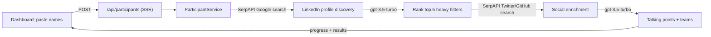

# HackaLink

Paste a hackathon's attendee list and get back the five people most worth meeting, personalized ice-breakers for each, and suggested teams — before you've finished your first coffee.

**🏆 Judge's Favorite — StackAuth Hackathon**

Walking into a 300-person hackathon, you have no idea who anyone is: who's a senior engineer worth pitching, who shares your background, who complements your skills. HackaLink takes a plain list of names, finds their public LinkedIn/Twitter/GitHub presence via Google search, and uses an LLM to rank who to talk to and what to open with. No LinkedIn scraping — everything comes from public search results or data participants provide themselves.


## What it does

- **Heavy hitters** — ranks the top 5 most influential participants by role seniority and company prestige, with a score and a one-line reason for each.
- **Talking points** — 3 conversation starters per top candidate, grounded in their actual role, headline, and recent tweets when found. Falls back to sensible generic openers if nothing is public.
- **Social enrichment** — finds Twitter/X and GitHub profiles for the top candidates so the ice-breakers reference real activity, not just a job title.
- **Team builder** — suggests teams of ~4 with complementary skills, with reasoning.
- **Similar backgrounds** — deterministic overlap scoring on shared schools, companies, and skills (no LLM guessing here).
- **LinkedIn post generator** — drafts a post about your hackathon experience, name-dropping the notable attendees you met.
- **Live progress** — analysis streams stage-by-stage over Server-Sent Events, so you watch it work through the list.

## How it works

Sign in through Stack Auth (`/login`, `/signup`, `src/app/handler/[...stack]`; `AuthGuard` gates the app). On the dashboard you paste names — one per line, optionally `Name | linkedin-url` — and the client POSTs them to `/api/participants`, which returns an SSE stream.



Key pieces, all under `src/`:

- `lib/services/participant-service.ts` — the pipeline: discover profiles, rank, enrich, generate.
- `lib/linkedin-scraper-legal.ts` — profile discovery via SerpAPI Google search (`site:linkedin.com/in/ "Name" "Company"`), parsed from result snippets. Supports the official LinkedIn API (`LINKEDIN_ACCESS_TOKEN`) and manual profile input as alternatives. No direct LinkedIn scraping.
- `lib/social-media-scraper.ts` — Twitter/X and GitHub discovery for top candidates, same SerpAPI approach.
- `lib/llm-client.ts` — all OpenAI calls (`gpt-3.5-turbo`, JSON mode): ranking, talking points, team suggestions, post generation. Every call has a rule-based fallback so the demo never blanks on an API hiccup.
- `lib/rate-limiter.ts` — sliding-window limiter (10 req/min with jitter) wrapping all SerpAPI calls.
- `app/api/linkedin-post/route.ts` — the post generator endpoint.

Everything runs server-side in Next.js App Router API routes; there's no database — results live in client state for the session.

## Tech stack

Next.js 14 (App Router) · TypeScript · Tailwind CSS · [Stack Auth](https://stack-auth.com) (`@stackframe/stack`) · OpenAI API · SerpAPI

## Run it locally

```bash
npm install
npm run dev   # http://localhost:3000
```

Create `.env.local` with:

| Variable | Purpose |
|---|---|
| `OPENAI_API_KEY` | Ranking, talking points, team suggestions, post generation (required) |
| `SERPAPI_API_KEY` | LinkedIn/Twitter/GitHub profile discovery via Google search (recommended — without it, analysis runs on names alone) |
| `NEXT_PUBLIC_STACK_PROJECT_ID` | Stack Auth project |
| `NEXT_PUBLIC_STACK_PUBLISHABLE_CLIENT_KEY` | Stack Auth client key |
| `STACK_SECRET_SERVER_KEY` | Stack Auth server key |
| `LINKEDIN_ACCESS_TOKEN` | Optional — official LinkedIn API as an alternate profile source |

`npm run build` / `npm start` for production, `npm run lint` to lint.

## Built at

Built by Abhiram Segu ([Nightwolf7570](https://github.com/Nightwolf7570)) at the StackAuth Hackathon, where it won **Judge's Favorite**. MIT licensed — fork it for your next hackathon.
