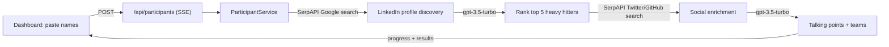

# HackaLink

Paste a hackathon attendee list to find five people worth meeting, personalized conversation starters, and suggested teams.

![Judge's Favorite — StackAuth Hackathon](https://img.shields.io/badge/Judge%27s_Favorite-StackAuth_Hackathon-B026FF?style=for-the-badge&labelColor=0D1117&logo=data%3Aimage%2Fsvg%2Bxml%3Bbase64%2CPHN2ZyB3aWR0aD0iNDgiIGhlaWdodD0iNDgiIHZpZXdCb3g9IjAgMCA0OCA0OCIgZmlsbD0ibm9uZSIgeG1sbnM9Imh0dHA6Ly93d3cudzMub3JnLzIwMDAvc3ZnIj48ZGVmcz48bGluZWFyR3JhZGllbnQgaWQ9Im5lb24tZ3JhZCIgeDE9IjQiIHkxPSI0IiB4Mj0iNDQiIHkyPSI0NCIgZ3JhZGllbnRVbml0cz0idXNlclNwYWNlT25Vc2UiPjxzdG9wIG9mZnNldD0iMCUiIHN0b3AtY29sb3I9IiMwMEZGRkYiIC8%2BPHN0b3Agb2Zmc2V0PSI1MCUiIHN0b3AtY29sb3I9IiMzQjgyRjYiIC8%2BPHN0b3Agb2Zmc2V0PSIxMDAlIiBzdG9wLWNvbG9yPSIjOEI1Q0Y2IiAvPjwvbGluZWFyR3JhZGllbnQ%2BPGZpbHRlciBpZD0iZ2xvdyIgeD0iLTUwJSIgeT0iLTUwJSIgd2lkdGg9IjIwMCUiIGhlaWdodD0iMjAwJSI%2BPGZlR2F1c3NpYW5CbHVyIHN0ZERldmlhdGlvbj0iMS41IiByZXN1bHQ9ImJsdXIxIiAvPjxmZUdhdXNzaWFuQmx1ciBzdGREZXZpYXRpb249IjMuNSIgcmVzdWx0PSJibHVyMiIgLz48ZmVNZXJnZT48ZmVNZXJnZU5vZGUgaW49ImJsdXIyIiAvPjxmZU1lcmdlTm9kZSBpbj0iYmx1cjEiIC8%2BPGZlTWVyZ2VOb2RlIGluPSJTb3VyY2VHcmFwaGljIiAvPjwvZmVNZXJnZT48L2ZpbHRlcj48ZyBpZD0iYmVuemVuZS1tYXJrIj48cGF0aCBkPSJNIDI0IDQgTCA0MS4zMiAxNCBMIDQxLjMyIDM0IEwgMjQgNDQgTCA2LjY4IDM0IEwgNi42OCAxNCBaIiBmaWxsPSJub25lIiBzdHJva2U9InVybCgjbmVvbi1ncmFkKSIgc3Ryb2tlLXdpZHRoPSIzIiBzdHJva2UtbGluZWpvaW49Im1pdGVyIiAvPjxwYXRoIGQ9Ik0gMTEgMTYuODcgTCAxNCAxNS4xMyBMIDE0IDMyLjg3IEwgMTEgMzEuMTMgWiIgZmlsbD0idXJsKCNuZW9uLWdyYWQpIiAvPjxwYXRoIGQ9Ik0gMTEgMTYuODcgTCAxNCAxNS4xMyBMIDE0IDMyLjg3IEwgMTEgMzEuMTMgWiIgZmlsbD0idXJsKCNuZW9uLWdyYWQpIiB0cmFuc2Zvcm09InJvdGF0ZSgxMjAgMjQgMjQpIiAvPjxwYXRoIGQ9Ik0gMTEgMTYuODcgTCAxNCAxNS4xMyBMIDE0IDMyLjg3IEwgMTEgMzEuMTMgWiIgZmlsbD0idXJsKCNuZW9uLWdyYWQpIiB0cmFuc2Zvcm09InJvdGF0ZSgyNDAgMjQgMjQpIiAvPjwvZz48L2RlZnM%2BPHVzZSBocmVmPSIjYmVuemVuZS1tYXJrIiBmaWx0ZXI9InVybCgjZ2xvdykiIG9wYWNpdHk9IjAuNzUiIC8%2BPHVzZSBocmVmPSIjYmVuemVuZS1tYXJrIiAvPjwvc3ZnPg%3D%3D)

At a large hackathon, it is hard to know who shares your interests or complements your skills. HackaLink takes a list of names, finds public LinkedIn, Twitter/X, and GitHub profiles through Google search, and uses an LLM to rank people you may want to meet. It also suggests what to say. HackaLink does not scrape LinkedIn. It uses public search results or information that participants provide.


## What it does

- **Top people** — ranks the five most influential participants by job level and company, with a score and short reason for each
- **Conversation starters** — creates three ideas for each top person based on their role, profile headline, and recent posts when available; otherwise, it uses general suggestions
- **Social profiles** — finds Twitter/X and GitHub profiles so suggestions can refer to real activity
- **Team builder** — suggests teams of about four people with complementary skills and explains each choice
- **Similar backgrounds** — scores shared schools, companies, and skills with fixed rules instead of an LLM
- **LinkedIn post generator** — drafts a post about your hackathon experience and the people you met
- **Live progress** — streams each stage through Server-Sent Events so you can follow the analysis

## How it works

Sign in with Stack Auth through `/login` or `/signup`. The handler is at `src/app/handler/[...stack]`, and `AuthGuard` protects the app. On the dashboard, enter one name per line. You can also use `Name | linkedin-url`. The client sends the list to `/api/participants`, which returns an SSE stream.



Main files under `src/`:

- `lib/services/participant-service.ts` — discovers profiles, ranks people, adds social data, and generates suggestions
- `lib/linkedin-scraper-legal.ts` — finds profiles with SerpAPI Google searches such as `site:linkedin.com/in/ "Name" "Company"`, then reads result snippets; it also supports the official LinkedIn API through `LINKEDIN_ACCESS_TOKEN` and manually entered profiles
- `lib/social-media-scraper.ts` — finds Twitter/X and GitHub profiles for top candidates with SerpAPI
- `lib/llm-client.ts` — uses OpenAI `gpt-3.5-turbo` in JSON mode for rankings, conversation starters, teams, and posts; every call has a rule-based fallback
- `lib/rate-limiter.ts` — limits SerpAPI calls to 10 requests per minute with added timing variation
- `app/api/linkedin-post/route.ts` — generates LinkedIn posts

Next.js App Router API routes run all processing on the server. There is no database; results stay in the browser for the current session.

## Tech stack

Next.js 14 (App Router) · TypeScript · Tailwind CSS · [Stack Auth](https://stack-auth.com) (`@stackframe/stack`) · OpenAI API · SerpAPI

## Run it locally

```bash
npm install
npm run dev   # http://localhost:3000
```

Create `.env.local` with:

| Variable | Purpose |
|---|---|
| `OPENAI_API_KEY` | Required for rankings, conversation starters, team suggestions, and posts |
| `SERPAPI_API_KEY` | Recommended for finding LinkedIn, Twitter/X, and GitHub profiles through Google; without it, analysis uses names only |
| `NEXT_PUBLIC_STACK_PROJECT_ID` | Stack Auth project |
| `NEXT_PUBLIC_STACK_PUBLISHABLE_CLIENT_KEY` | Stack Auth client key |
| `STACK_SECRET_SERVER_KEY` | Stack Auth server key |
| `LINKEDIN_ACCESS_TOKEN` | Optional access to the official LinkedIn API as another profile source |

For production, run `npm run build` and then `npm start`. Run `npm run lint` to check the code.

## Built at

Built by Abhiram Segu ([Nightwolf7570](https://github.com/Nightwolf7570)) at the StackAuth Hackathon, where it won **Judge's Favorite**. Licensed under MIT.
